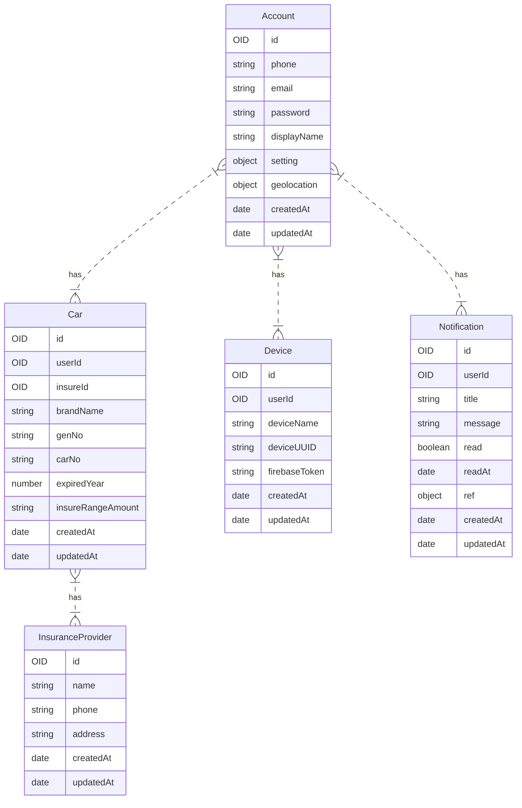
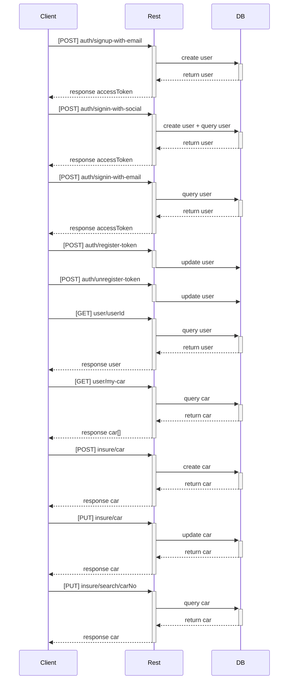

# Madi API
Madi API is a RESTful API built with Go, NestJS, and MongoDB. The API is designed to support the Madi mobile application, which is built with Ionic. The project is open source and hosted on GitHub.

> The goal of Madi API is to improve daily lives by providing useful services and easy-to-use interfaces.

The following table lists the available services and their corresponding endpoints:

| Services | Method	| Endpoint	| Description   |
| -------- | ------ | --------- |  ----------   |
| Authentication |	POST |  auth/signup-with-email	| Register using an email address               |
| Authentication |	POST |  auth/signin-with-social	| Sign in and register with a social account    |
| Authentication |	GET	 |  auth/signin-with-email	| Sign in using an email address                |
| Authentication |	POST |  auth/register-token	    | Register for FCM messaging                    |
| Authentication |	POST |  auth/unregister-token	| Unregister for FCM messaging                  |
| User           |  GET	 |  user/:userId	        | Retrieve a user's information                 |
| User           |  GET	 |  user/my-car	            | Retrieve the user's car information           |
| User           |  POST |  user/car	            | Add a car (e.g. MG)                           |
| User           |  PUT	 |  user/car	            | Edit a car (e.g. only have the key)           |
| Insurance      |	GET	 |  insure/search/:carNo	| Search for a specific car                     |
| Notification   |	GET	 |  notification/list	    | Retrieve notifications                        |

** Getting Started **
These instructions will help you get a copy of the project up and running on your local machine for development and testing purposes.
Prerequisites
* Go version 1.15+
* Node.js version 14+
* MongoDB version 4.4+
Installation
1. Clone the repository to your local machine
``` git clone https://github.com/nuza555xx/madi-api.git ```

2. Change into the project directory
``` cd madi-api ```

3. Install the dependencies
```
go get -d -v ./... 
npm install 
```

4. Start the MongoDB server
``` mongod ```

5. Build and run the API
``` 
cd authentication
go build .

cd user
npm run build

```
6. The API should now be running on http://localhost:3000
Project Structure
The project is separated into two main directories:
* authentication: This folder contains the Go code for handling user authentication and authorization.
* user: This folder contains the NestJS code for handling user management (CRUD operations)
Built With
* Go - The programming language used
* NestJS - A progressive Node.js framework for building efficient and scalable server-side applications
* Ionic - A popular open-source framework for building cross-platform mobile applications
* MongoDB - A NoSQL document-based database
Contributing
Please read CONTRIBUTING.md for details on our code of conduct, and the process for submitting pull requests to us.
Versioning
We use SemVer for versioning. For the versions available, see the tags on this repository.
Authors
* Nuza - Initial work - nuza555xx
See also the list of contributors who participated in this project.
License
This project is licensed under the MIT License - see the LICENSE.md file for details
# ER Diagram


# Sequence Diagram




