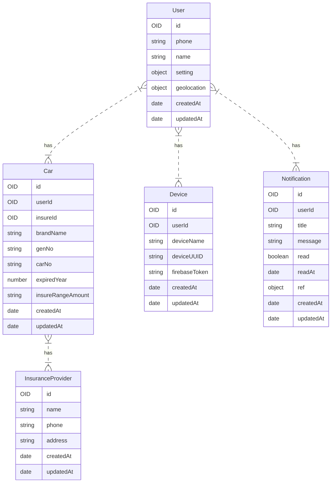
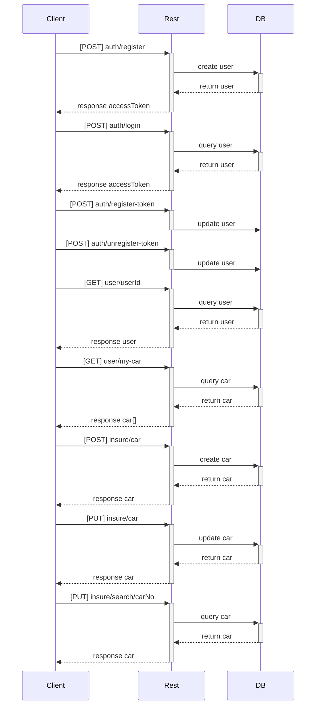

# Madi API
  ของดี

> ทำวันนี้ให้แย่กว่าเมื่อวาน พร่ามมม

| Services | Method |  Endpoint |  Description  |
| -------- | ------ | --------- |  ----------   |
| Authentication | POST | auth/register         | สมัครสมาชิกไงกำ                 |
| Authentication | GET  | auth/login            | เข้าสู่ระบบ                      |
| Authentication | POST | auth/register-token   | สมัคร fcm messaging            |
| Authentication | POST | auth/unregister-token | ยกเลิกสมัคร fcm messaging.      |
| User           | GET  | user/:userId          | แสดงข้อมูลผู้ใช้                   |
| User           | GET  | user/my-car           | แสดงข้อมูลรถโง่ๆ                 |
| Insurance      | POST | insure/car            | เพิ่มรถของตัวเอง เช่น MG          |
| Insurance      | PUT  | insure/car            | แก้ไขรถตัวเอง เช่น เหลือแค่ผ่อนกุญแจ |
| Insurance      | GET  | insure/search/:carNo  | ค้นหารถไอ้เหี้ยนั้น                 |
| Notification   | GET  | notification/list     | แจ้งเตือนโง่ๆ                    |

# ER Diagram

# Sequence Diagram

# Tech Stacks
| Name | Meaning | Role
| -------- | ------ |
| IONIC Framework | Using application cross platform is easy. | Frontend
| Golang | Using api prove business logic is the fast. | Backend
| MongoDB | Using store data. | Store
| Redis | Using cache data is stable. | Store
| Firebase | Using make push notification to device | Provide

